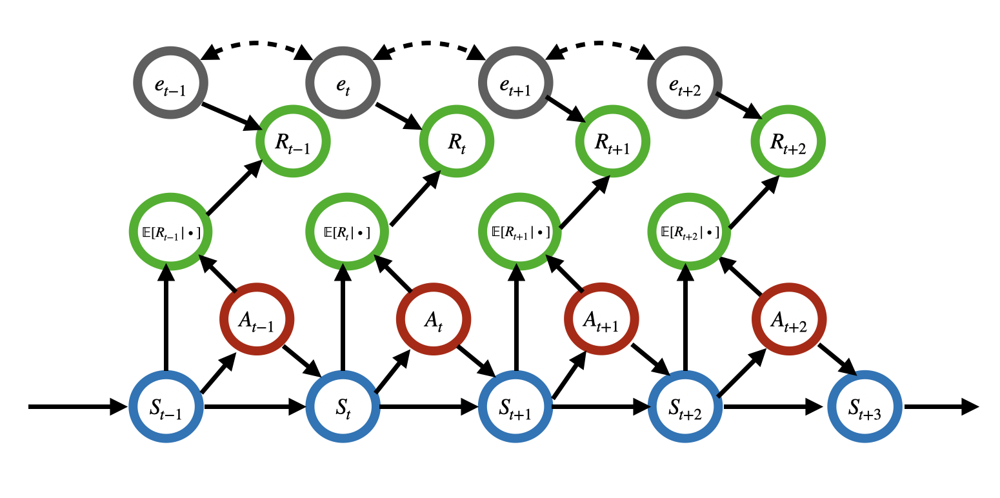

# SwitchMDP
**Unraveling the Interplay Between Carryover Effects and Reward Autocorrelations in Switchback Experiments**  
*(ICML 2025 accepted)*

---

## 📘 Introduction

This repository provides a full implementation for evaluating ATE estimation methods in switchback experiments under various Markov Decision Process (MDP) settings. Our focus is on understanding the impact of **carryover effects** and **reward autocorrelations** on estimation bias and variance.

## 🧩 Graphical Visualization of Our Model

Visualization of our MDP with autocorrelated reward errors. The solid lines represent the causal relationships. The dashed lines imply that the reward errors are potentially correlated.

---

## 📂 File Overview

### 🔧 Data Generation
- `actions_dgp.R`: Generates switchback-style treatment assignments.
- `ATE_true_approximate.R`: Simulates synthetic data based on different MDPs (both linear and nonlinear).

### 📈 Estimation Methods
- `OLS.R`: Computes OLS estimates and their bias, standard deviation (SD), and mean squared error (MSE).
- `MLSTD.R`: Computes modified LSTD estimates with evaluation metrics.
- `DRL_MLSTD.R`: Computes model-free DRL estimates (bias, SD, MSE).
- `self_basis_functions.R`: Constructs orthogonal linear sieve basis functions.
- `DRL_assist_funcs.R`: Contains helper functions for DRL and LSTD implementations.

### 📚 Baseline Implementations
- `Bojinov_opt_design.R`: Implements the method proposed by Bojinov et al. (2023).
- `Hu_DIM.R`: Implements the method from Hu et al. (2022).
- `IS_estimator.R`: Implements the empirical Bayes estimator from Xiong et al. (2024).
- `Compare_all_plots.R`: Compares the above methods with our proposed estimators and generates plots.

---

## 📝 Notes

1. `TI` and `m` are used interchangeably in the code to represent the **time span**.
2. All scripts are designed to run **directly** from the current folder without additional setup.
3. To switch between **Linear** and **Nonlinear** DGPs, modify `ATE_true_approximate.R` accordingly.
4. Output results (e.g., bias, SD, MSE) are saved and later used for visualization and analysis.

---

Feel free to raise issues or submit pull requests if you have questions or improvements!
